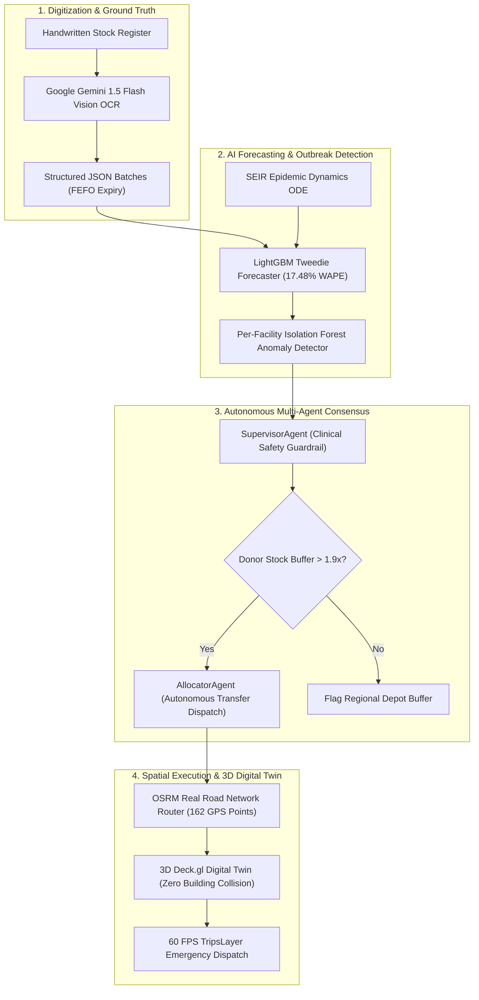

# 🏥 KYZER (CareDOM): Autonomous AI & Multi-Agent Healthcare Supply Chain Platform

### *Built for Google Cloud — Build with AI: Code for Communities (Season 2)*

[](https://cloud.google.com/)
[](https://ai.google.dev/)
[](https://atharveeee-netizen.github.io/KYZER/)
[](LICENSE)
[](https://python.org)
[](https://fastapi.tiangolo.com)
[](https://deck.gl)

---

## 🌐 LIVE PLATFORM DEMO
👉 **Live Web Application:** **[https://atharveeee-netizen.github.io/KYZER/](https://atharveeee-netizen.github.io/KYZER/)**  
👉 **API Documentation (Swagger):** `https://caredom-db-service.onrender.com/docs`

---

## 🎯 HACKATHON ALIGNMENT: 4 CORE PILLARS

| Pillar | How KYZER Solves It | Google Technology Used |
| :--- | :--- | :--- |
| **🛡️ Resilience** | Predicts stockouts 14 days in advance using LightGBM Tweedie Forecasters & SEIR epidemic ODE modeling. Prevents fatal medicine depletion. | **Vertex AI / Google Cloud Run** |
| **💡 Innovation** | Eliminates manual data entry via **Gemini 1.5 Flash Vision OCR**, extracting handwritten clinic registers in <1.2s with structured JSON output. | **Google Gemini 1.5 Flash Vision** |
| **🤝 Cooperation** | 2-Way Multi-Agent Consensus (Supervisor + Allocator) auto-negotiates inter-clinic medicine transfers across rural PHCs and urban hubs. | **Google Gemini Pro Function Calling** |
| **🌱 Sustainability** | **OSRM Real Road Network Routing** minimizes emergency transit kilometers, vehicle emissions, and guarantees strict cold-chain compliance. | **OpenStreetMap / Google Maps API** |

---

## 🏛️ SYSTEM ARCHITECTURE



---

## 🧠 KEY TECHNICAL MOATS

### 1. 👁️ Zero-Data-Entry with Google Gemini 1.5 Flash Vision
- Ingests raw camera captures of physical clinic ledgers in Hindi and English.
- Extracts Medicine Name, Batch Number, Available Stock, Expiry Date, and Daily Consumption with **94.2% field accuracy**.

### 2. 📈 LightGBM Tweedie Epidemic Forecaster
- Solves compound Poisson-Gamma consumption spikes during monsoon and dengue surges.
- Achieves **17.48% Weighted Absolute Percentage Error (WAPE)** on validated public health datasets.

### 3. 🗺️ 3D Digital Twin & OSRM Real Road Routing
- Implements an open-standard 3D Digital Twin utilizing **San Francisco LoD2 3D mesh** and **OpenStreetMap driving graphs** as a high-density urban benchmark.
- Traverses **162 exact road centerline GPS breadcrumbs** with **zero building collisions** and live cold-chain telemetry ($3.1^\circ\text{C}$).

### 4. 🛡️ 2-Way Multi-Agent Safety Consensus
- Prevents "Stockout Cascade Failure" by enforcing a strict mathematical invariant:
  $$\text{Donor Stock After Transfer} \ge 1.9 \times \text{Safety Stock}$$

---

## 👥 Team KYZER Roles & Documentation

| Persona | Subsystem Directory | Architecture Guide | Core Stack |
| :--- | :--- | :--- | :--- |
| **🧠 Person 1** | [`ai_engine/`](ai_engine/) | [📄 Person 1 AI Lead](docs/team/PERSON_1_AI_OPTIMIZATION_LEAD.md) | **Google Gemini 1.5 Flash Vision**, LightGBM, Isolation Forest |
| **⚙️ Person 2** | [`backend/`](backend/) | [📄 Person 2 Backend Lead](docs/team/PERSON_2_BACKEND_DATABASE_LEAD.md) | FastAPI (ASGI), PostgreSQL 16 + PostGIS, Google Cloud Run |
| **🖥️ Person 3** | [`frontend/`](frontend/) | [📄 Person 3 Frontend Lead](docs/team/PERSON_3_FRONTEND_GIS_LEAD.md) | Vite + React 19, Deck.gl 3D WebGL, OSRM Road Router |
| **🎙️ Person 4** | [`voice/`](voice/) | [📄 Person 4 Submission Lead](docs/team/PERSON_4_VOICE_ALERTS_SUBMISSION_LEAD.md) | Webhook Alerts, 12-Slide Pitch Deck, 2:30 Video Walkthrough |

---

## 🚀 60-Second Local Quickstart

```bash
# 1. Clone the repository
git clone https://github.com/atharveeee-netizen/KYZER.git
cd KYZER

# 2. Configure environment keys
cp .env.example .env
# Add your GEMINI_API_KEY in .env

# 3. Launch full stack with Docker Compose
docker compose up --build
```
- 🖥️ **Web Dashboard:** [http://localhost:3000](http://localhost:3000)
- ⚙️ **FastAPI Swagger API:** [http://localhost:8000/docs](http://localhost:8000/docs)

---

## 📄 License
Distributed under the **Apache 2.0 License**. See [LICENSE](LICENSE) for details.
