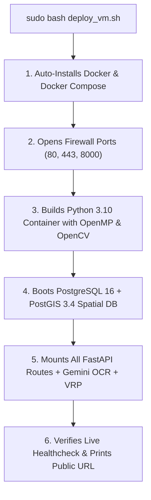

# 🚀 KYZER (CareDOM) — Master Linux VM Deployment Guide

This guide details how to launch and host the full **KYZER Backend, AI Engine, and PostGIS Database** on a Linux Virtual Machine (Google Cloud Compute Engine, AWS EC2, DigitalOcean Droplet, or Hetzner).

---

## 🛠️ PREREQUISITES: RECOMMENDED VM SPECS

```
┌────────────────────┬────────────────────────────────────────────────────────┐
│ PARAMETER          │ RECOMMENDED SPECIFICATION                              │
├────────────────────┼────────────────────────────────────────────────────────┤
│ 🖥️ OS              │ Ubuntu 22.04 LTS / Ubuntu 24.04 LTS (x86_64)           │
│ 🧠 vCPU            │ 2 to 4 vCPUs (e.g. GCP e2-standard-2 / AWS t3.medium)  │
│ 💾 RAM             │ 4 GB to 8 GB RAM                                       │
│ 🗄️ SSD             │ 25 GB to 50 GB SSD                                     │
│ 🌐 Inbound Ports   │ 22 (SSH), 80 (HTTP), 443 (HTTPS), 8000 (FastAPI API)   │
└────────────────────┴────────────────────────────────────────────────────────┘
```

---

## ⚡ 60-SECOND 1-CLICK DEPLOYMENT:

Connect to your Linux VM via SSH and execute the following 3 commands:

```bash
# Step 1: Clone the repository
git clone https://github.com/atharveeee-netizen/KYZER.git
cd KYZER

# Step 2: Configure Environment Keys
cp .env.example .env
# Edit .env to paste your GEMINI_API_KEY (optional)
nano .env

# Step 3: Run the 1-Click Deployment Script
sudo bash deploy_vm.sh
```

---

## 🌐 WHAT HAPPENS AUTOMATICALLY:



---

## 📊 LIVE SERVICE URLS AFTER DEPLOYMENT:

Once `deploy_vm.sh` finishes, your endpoints will be available at:

* **🌐 Interactive Swagger API Docs:** `http://<YOUR_VM_PUBLIC_IP>:8000/docs`
* **🩺 Health Check Probe:** `http://<YOUR_VM_PUBLIC_IP>:8000/health`
* **💊 Inventory Endpoint:** `http://<YOUR_VM_PUBLIC_IP>:8000/api/v1/inventory`
* **🏥 Facilities Endpoint:** `http://<YOUR_VM_PUBLIC_IP>:8000/api/v1/facilities`
* **📸 Gemini OCR Upload:** `POST http://<YOUR_VM_PUBLIC_IP>:8000/api/v1/ocr/upload`
* **🗺️ Frontend Web Application:** [https://atharveeee-netizen.github.io/KYZER/](https://atharveeee-netizen.github.io/KYZER/)

---

## 🔧 USEFUL MANAGEMENT COMMANDS:

```bash
# View live container logs in real time
sudo docker logs -f caredom-api

# View PostGIS database logs
sudo docker logs -f caredom-postgres

# Restart all services
sudo docker-compose restart

# Stop all services
sudo docker-compose down
```
